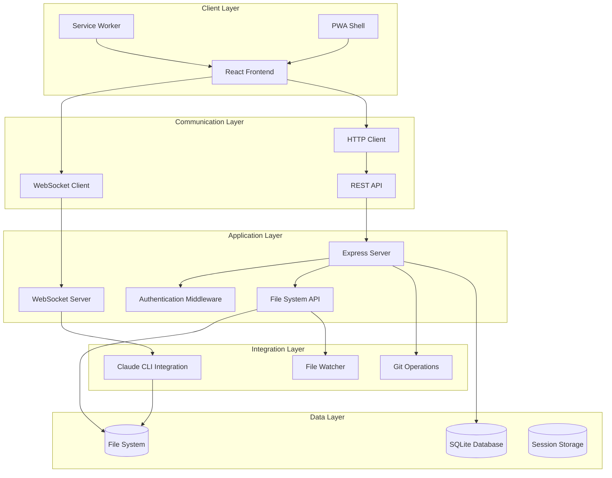
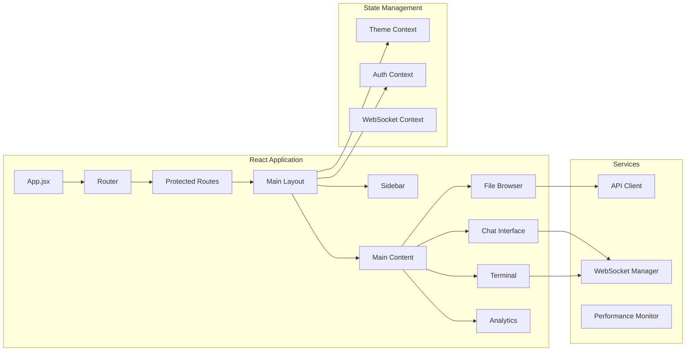
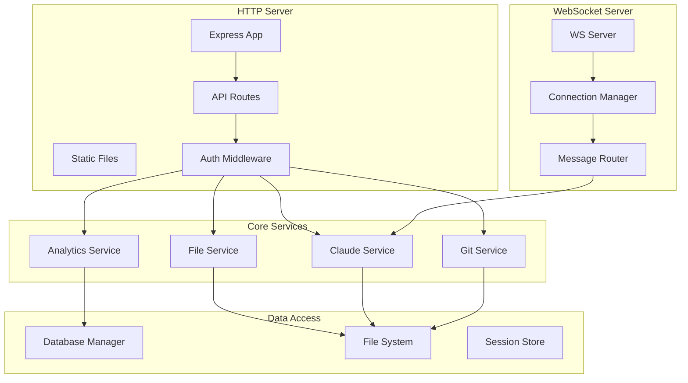
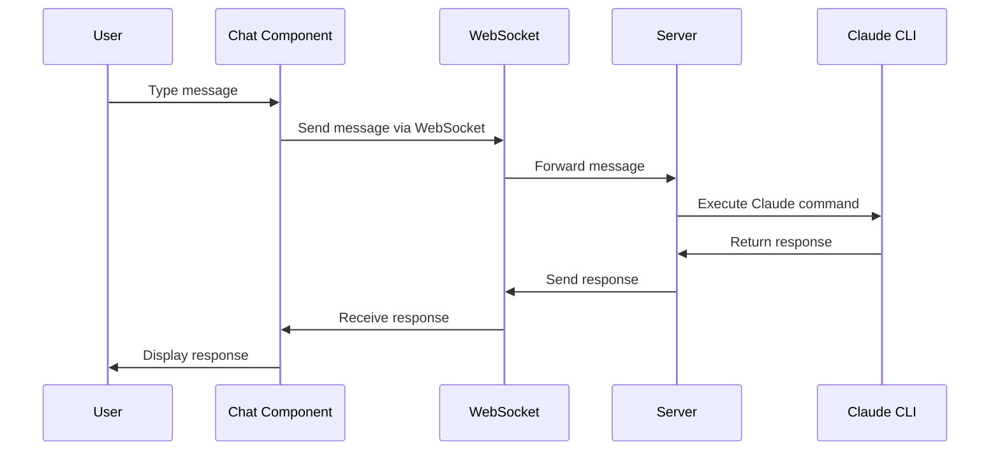
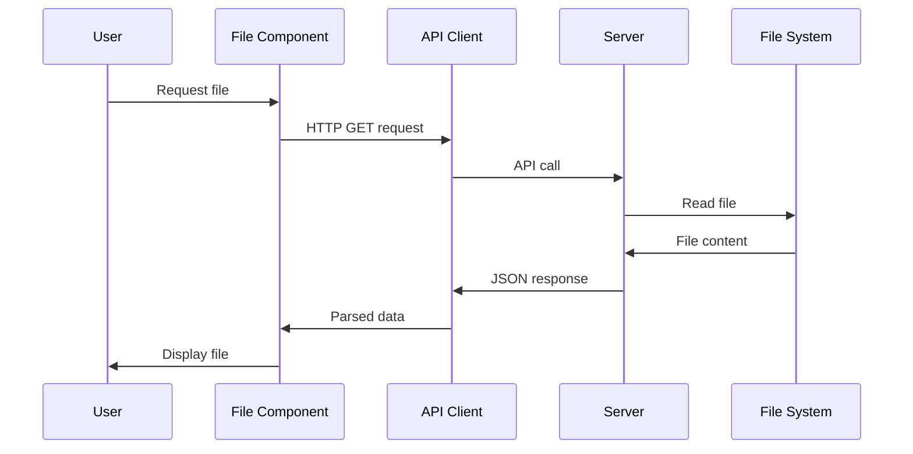
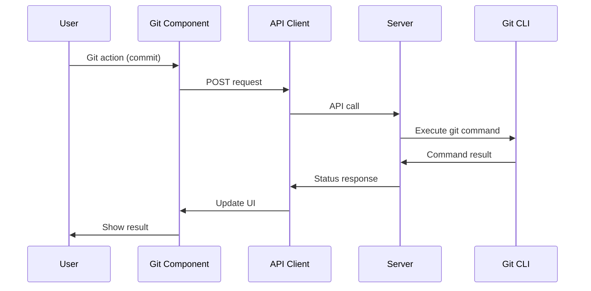
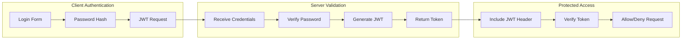
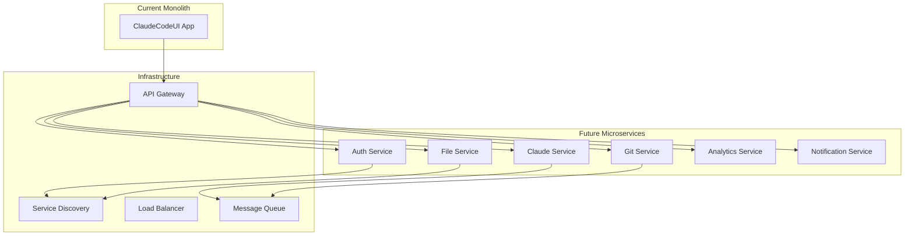

# ClaudeCodeUI Architecture Documentation

## System Overview

ClaudeCodeUI is a modern, full-stack web application that provides a user-friendly interface for Claude Code CLI. Built with a React frontend and Node.js backend, it enables seamless interaction with AI-powered coding assistance through a responsive web interface.

## Architecture Diagram



## Technology Stack

### Frontend Technologies

**Core Framework:**
- **React 18**: Modern component architecture with hooks and concurrent features
- **Vite**: Fast build tool with hot module replacement
- **React Router 6**: Client-side routing with modern navigation

**UI & Styling:**
- **Tailwind CSS**: Utility-first CSS framework for rapid styling
- **Lucide Icons**: Modern icon library with React components
- **CodeMirror**: Advanced code editor with syntax highlighting

**State Management:**
- **React Context**: Global state management for theme, auth, and settings
- **Local Storage**: Persistent client-side storage for preferences
- **Session Storage**: Temporary state for user sessions

**Real-time Communication:**
- **WebSocket API**: Bidirectional communication for chat and terminal
- **EventSource**: Server-sent events for file watching
- **Fetch API**: Modern HTTP client for REST operations

### Backend Technologies

**Core Server:**
- **Node.js**: JavaScript runtime for server-side execution
- **Express.js**: Web framework for REST API and static file serving
- **ws**: WebSocket library for real-time communication

**Data Storage:**
- **SQLite**: Lightweight database for analytics and user data
- **File System**: Direct file operations with node:fs
- **In-Memory Store**: Session and cache management

**Integration Services:**
- **child_process**: Claude CLI command execution
- **chokidar**: File system watching for change detection
- **node-pty**: Terminal emulation for shell operations

**Authentication & Security:**
- **bcrypt**: Password hashing and verification
- **jsonwebtoken**: JWT token generation and validation
- **cors**: Cross-origin resource sharing configuration

## System Components

### Frontend Architecture



#### Component Hierarchy

```
App.jsx                           // Root application component
├── ThemeProvider                 // Dark/light theme management
├── AuthProvider                  // Authentication state
├── Router                        // Client-side routing
│   ├── PublicRoute               // Login/setup pages
│   │   ├── LoginForm            // Authentication interface
│   │   └── SetupForm            // Initial setup
│   └── ProtectedRoute           // Authenticated pages
│       ├── MainLayout           // Application shell
│       │   ├── Sidebar          // Navigation and project list
│       │   │   ├── ProjectList
│       │   │   ├── SessionList
│       │   │   └── GitStatus
│       │   └── MainContent      // Primary content area
│       │       ├── ChatInterface // Claude conversation
│       │       ├── FileTree     // File browser
│       │       ├── Shell        // Terminal interface
│       │       └── Analytics    // Usage statistics
│       └── MobileNav           // Mobile navigation
└── ServiceWorkerManager        // PWA functionality
```

### Backend Architecture



#### Server Structure

```
server/
├── index.js                     // Application entry point
├── middleware/                  // Express middleware
│   ├── auth.js                 // Authentication middleware
│   ├── analytics.js            // Usage tracking
│   └── cors.js                 // CORS configuration
├── routes/                     // API route handlers
│   ├── auth.js                 // Authentication endpoints
│   ├── files.js                // File operations
│   ├── claude.js               // Claude CLI integration
│   ├── git.js                  // Git operations
│   ├── analytics.js            // Analytics endpoints
│   └── health.js               // Health check
├── services/                   // Business logic
│   ├── claudeService.js        // Claude CLI wrapper
│   ├── fileService.js          // File system operations
│   ├── gitService.js           // Git command wrapper
│   └── analyticsService.js     // Data collection
├── database/                   // Data layer
│   ├── db.js                   // Database connection
│   ├── migrations/             // Schema changes
│   └── models/                 // Data models
└── utils/                      // Utility functions
    ├── logger.js               // Logging service
    ├── validation.js           // Input validation
    └── security.js             // Security utilities
```

## Data Flow

### Chat Message Flow



### File Operation Flow



### Git Operation Flow



## Security Architecture

### Authentication Flow



### Security Layers

**Client-Side Security:**
- JWT token storage in memory (not localStorage for security)
- Automatic token renewal before expiration
- HTTPS enforcement in production
- Content Security Policy headers

**Server-Side Security:**
- Password hashing with bcrypt (12+ rounds)
- JWT token validation on all protected routes
- Rate limiting to prevent brute force attacks
- Input validation and sanitization

**Network Security:**
- CORS configuration for allowed origins
- Secure WebSocket connections (WSS in production)
- Request size limits to prevent DoS
- Helmet.js security headers

### Data Protection

**Sensitive Data Handling:**
- Passwords never stored in plain text
- JWT tokens include minimal claims
- File operations restricted to project directories
- Command execution sandboxing

**Audit Trail:**
- Authentication attempts logged
- File operations tracked
- Git operations recorded
- Error events captured

## Performance Architecture

### Frontend Optimization

**Code Splitting:**
```javascript
// Route-based code splitting
const ChatInterface = lazy(() => import('./components/ChatInterface'));
const FileTree = lazy(() => import('./components/FileTree'));
const Analytics = lazy(() => import('./components/Analytics'));

// Component-level optimization
const ExpensiveComponent = memo(({ data }) => {
  const memoizedValue = useMemo(() => 
    expensiveCalculation(data), [data]
  );
  
  return <div>{memoizedValue}</div>;
});
```

**Bundle Optimization:**
```javascript
// vite.config.js
export default {
  build: {
    rollupOptions: {
      output: {
        manualChunks: {
          'react-vendor': ['react', 'react-dom'],
          'editor': ['@codemirror/lang-javascript'],
          'ui-vendor': ['lucide-react']
        }
      }
    }
  }
}
```

**Performance Monitoring:**
```javascript
// Web Vitals integration
import { getCLS, getFID, getFCP, getLCP, getTTFB } from 'web-vitals';

getCLS(console.log);
getFID(console.log);
getFCP(console.log);
getLCP(console.log);
getTTFB(console.log);
```

### Backend Optimization

**Caching Strategy:**
```javascript
// Memory cache for frequent requests
const cache = new Map();

app.get('/api/files/:project', (req, res) => {
  const cacheKey = `files-${req.params.project}`;
  
  if (cache.has(cacheKey)) {
    return res.json(cache.get(cacheKey));
  }
  
  const files = fileService.listFiles(req.params.project);
  cache.set(cacheKey, files);
  
  res.json(files);
});
```

**Database Optimization:**
```sql
-- Indexed queries for analytics
CREATE INDEX idx_analytics_timestamp ON analytics(timestamp);
CREATE INDEX idx_sessions_project ON sessions(project_id);
CREATE INDEX idx_messages_session ON messages(session_id);
```

**Connection Management:**
```javascript
// WebSocket connection pooling
class ConnectionManager {
  constructor() {
    this.connections = new Map();
    this.heartbeat = setInterval(this.ping.bind(this), 30000);
  }
  
  ping() {
    this.connections.forEach((ws, id) => {
      if (ws.readyState === WebSocket.OPEN) {
        ws.ping();
      } else {
        this.connections.delete(id);
      }
    });
  }
}
```

## Scalability Considerations

### Horizontal Scaling

**Load Balancer Configuration:**
```nginx
upstream claudeui_backend {
    server 127.0.0.1:3008;
    server 127.0.0.1:3009;
    server 127.0.0.1:3010;
}

server {
    location / {
        proxy_pass http://claudeui_backend;
        proxy_http_version 1.1;
        proxy_set_header Upgrade $http_upgrade;
        proxy_set_header Connection 'upgrade';
        proxy_cache_bypass $http_upgrade;
    }
}
```

**Session Persistence:**
```javascript
// Redis session store
const session = require('express-session');
const RedisStore = require('connect-redis')(session);

app.use(session({
  store: new RedisStore({
    host: 'redis-cluster',
    port: 6379
  }),
  secret: process.env.SESSION_SECRET
}));
```

### Database Scaling

**Read Replicas:**
```javascript
// Database connection with read/write splitting
class DatabaseManager {
  constructor() {
    this.writeDB = new Database('primary.db');
    this.readDB = new Database('replica.db');
  }
  
  query(sql, params) {
    if (sql.toLowerCase().startsWith('select')) {
      return this.readDB.prepare(sql).all(params);
    }
    return this.writeDB.prepare(sql).run(params);
  }
}
```

**Data Partitioning:**
```javascript
// Project-based data partitioning
class PartitionedStorage {
  constructor() {
    this.partitions = new Map();
  }
  
  getPartition(projectId) {
    const hash = this.hash(projectId);
    const partition = hash % this.partitionCount;
    return this.partitions.get(partition);
  }
}
```

## Deployment Architecture

### Development Environment

```yaml
# docker-compose.dev.yml
version: '3.8'
services:
  frontend:
    build:
      context: .
      target: development
    ports:
      - "3009:3009"
    volumes:
      - ./src:/app/src
      - ./public:/app/public
    environment:
      - NODE_ENV=development
      - FAST_REFRESH=true
  
  backend:
    build:
      context: .
      target: backend-dev
    ports:
      - "3008:3008"
    volumes:
      - ./server:/app/server
      - ~/.claude:/home/node/.claude:ro
    environment:
      - NODE_ENV=development
      - DEBUG=claudeui:*
```

### Production Environment

```yaml
# docker-compose.prod.yml
version: '3.8'
services:
  app:
    build:
      context: .
      target: production
    ports:
      - "3008:3008"
    environment:
      - NODE_ENV=production
    healthcheck:
      test: ["CMD", "curl", "-f", "http://localhost:3008/health"]
      interval: 30s
      timeout: 10s
      retries: 3
    restart: unless-stopped
  
  nginx:
    image: nginx:alpine
    ports:
      - "80:80"
      - "443:443"
    volumes:
      - ./nginx.conf:/etc/nginx/nginx.conf
      - ./ssl:/etc/nginx/ssl
    depends_on:
      - app
```

### Kubernetes Deployment

```yaml
# k8s/deployment.yaml
apiVersion: apps/v1
kind: Deployment
metadata:
  name: claudeui
spec:
  replicas: 3
  selector:
    matchLabels:
      app: claudeui
  template:
    metadata:
      labels:
        app: claudeui
    spec:
      containers:
      - name: claudeui
        image: claudeui:latest
        ports:
        - containerPort: 3008
        env:
        - name: NODE_ENV
          value: "production"
        livenessProbe:
          httpGet:
            path: /health
            port: 3008
          initialDelaySeconds: 30
          periodSeconds: 10
        readinessProbe:
          httpGet:
            path: /health
            port: 3008
          initialDelaySeconds: 5
          periodSeconds: 5
```

## Monitoring and Observability

### Application Metrics

```javascript
// Custom metrics collection
class MetricsCollector {
  constructor() {
    this.counters = new Map();
    this.gauges = new Map();
    this.histograms = new Map();
  }
  
  incrementCounter(name, labels = {}) {
    const key = `${name}:${JSON.stringify(labels)}`;
    this.counters.set(key, (this.counters.get(key) || 0) + 1);
  }
  
  recordGauge(name, value, labels = {}) {
    const key = `${name}:${JSON.stringify(labels)}`;
    this.gauges.set(key, value);
  }
  
  recordHistogram(name, value, labels = {}) {
    const key = `${name}:${JSON.stringify(labels)}`;
    const histogram = this.histograms.get(key) || [];
    histogram.push({ value, timestamp: Date.now() });
    this.histograms.set(key, histogram);
  }
}
```

### Health Checks

```javascript
// Comprehensive health check
app.get('/health', async (req, res) => {
  const health = {
    status: 'healthy',
    timestamp: new Date().toISOString(),
    uptime: process.uptime(),
    checks: {}
  };

  // Database check
  try {
    await db.get('SELECT 1');
    health.checks.database = { status: 'healthy' };
  } catch (error) {
    health.checks.database = { status: 'unhealthy', error: error.message };
    health.status = 'degraded';
  }

  // Claude CLI check
  try {
    await exec('which claude');
    health.checks.claudeCLI = { status: 'healthy' };
  } catch (error) {
    health.checks.claudeCLI = { status: 'unhealthy', error: 'Claude CLI not found' };
    health.status = 'degraded';
  }

  // Memory check
  const memoryUsage = process.memoryUsage();
  const memoryPercent = (memoryUsage.heapUsed / memoryUsage.heapTotal) * 100;
  health.checks.memory = {
    status: memoryPercent > 90 ? 'warning' : 'healthy',
    usage: Math.round(memoryUsage.heapUsed / 1024 / 1024) + 'MB',
    percentage: memoryPercent.toFixed(2) + '%'
  };

  const statusCode = health.status === 'healthy' ? 200 : 503;
  res.status(statusCode).json(health);
});
```

### Logging Strategy

```javascript
// Structured logging
const winston = require('winston');

const logger = winston.createLogger({
  level: process.env.LOG_LEVEL || 'info',
  format: winston.format.combine(
    winston.format.timestamp(),
    winston.format.errors({ stack: true }),
    winston.format.json()
  ),
  defaultMeta: { 
    service: 'claudeui',
    version: process.env.VERSION 
  },
  transports: [
    new winston.transports.File({ filename: 'logs/error.log', level: 'error' }),
    new winston.transports.File({ filename: 'logs/combined.log' }),
    new winston.transports.Console({
      format: winston.format.simple()
    })
  ]
});
```

## API Design Principles

### RESTful API Design

```javascript
// Consistent API structure
const apiRouter = express.Router();

// Resource-based URLs
apiRouter.get('/projects', listProjects);
apiRouter.get('/projects/:id', getProject);
apiRouter.post('/projects', createProject);
apiRouter.put('/projects/:id', updateProject);
apiRouter.delete('/projects/:id', deleteProject);

// Nested resources
apiRouter.get('/projects/:id/sessions', listProjectSessions);
apiRouter.get('/projects/:projectId/sessions/:sessionId', getSession);

// Action-based endpoints for non-CRUD operations
apiRouter.post('/projects/:id/actions/sync', syncProject);
apiRouter.post('/sessions/:id/actions/archive', archiveSession);
```

### WebSocket Message Format

```javascript
// Consistent message structure
const messageSchema = {
  type: 'string',           // Message type identifier
  id: 'string',             // Optional correlation ID
  timestamp: 'ISO8601',     // Message timestamp
  data: 'object',           // Message payload
  error: 'object'           // Optional error information
};

// Example messages
const chatMessage = {
  type: 'chat-message',
  id: 'msg-123',
  timestamp: '2023-12-07T10:30:00Z',
  data: {
    sessionId: 'session-456',
    content: 'Help me debug this function',
    attachments: []
  }
};

const errorMessage = {
  type: 'error',
  id: 'msg-123',
  timestamp: '2023-12-07T10:30:05Z',
  error: {
    code: 'CLAUDE_EXECUTION_ERROR',
    message: 'Failed to execute Claude command',
    details: { exitCode: 1 }
  }
};
```

## Future Architecture Considerations

### Microservices Migration



### Event-Driven Architecture

```javascript
// Event system for decoupled components
class EventBus {
  constructor() {
    this.listeners = new Map();
  }
  
  emit(event, data) {
    const handlers = this.listeners.get(event) || [];
    handlers.forEach(handler => handler(data));
  }
  
  on(event, handler) {
    const handlers = this.listeners.get(event) || [];
    handlers.push(handler);
    this.listeners.set(event, handlers);
  }
}

// Usage
eventBus.on('file.changed', (data) => {
  // Invalidate cache
  // Update UI
  // Notify connected clients
});

eventBus.emit('file.changed', {
  projectId: 'project-123',
  filePath: 'src/app.js',
  changeType: 'modified'
});
```

This architecture documentation provides a comprehensive overview of ClaudeCodeUI's technical design, implementation details, and scalability considerations. It serves as a reference for developers, system administrators, and stakeholders involved in the project.